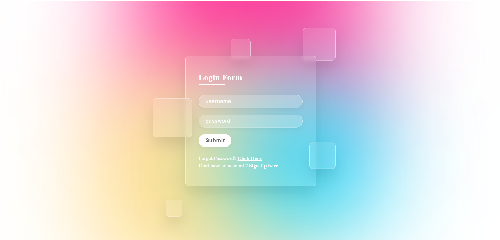

# Glassmorphism Login Form  

A sleek and modern **Glassmorphism-style login form** built with HTML and CSS.  
This project highlights frosted glass effects, smooth gradients, and subtle animations, creating a visually appealing and minimal UI component that can be integrated into any website.  

---

## 🚀 Features  
- Elegant frosted glass effect using `backdrop-filter`  
- Dynamic gradient background with soft color blending  
- Animated floating shapes for a lively look  
- Fully responsive and centered login form  
- Clean and minimal design, easy to customize  

---

## 📸 Preview  
🔗 **[Live Demo](https://glassmorphism-login-form-rho.vercel.app/)**  

  

---

## 🛠️ Tech Stack  
- **HTML5** – structure and layout  
- **CSS3** – glassmorphism, gradients, animations  

---

## 📂 Project Structure  
